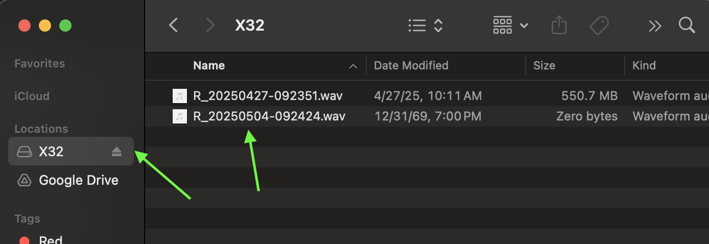
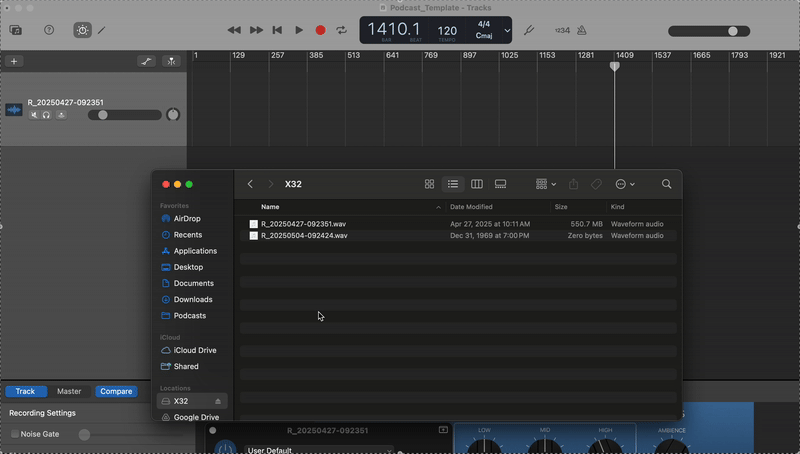
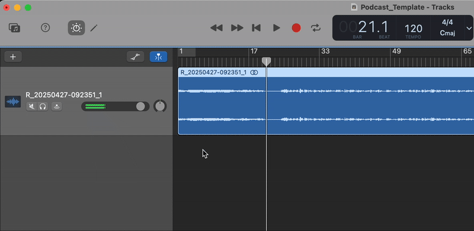
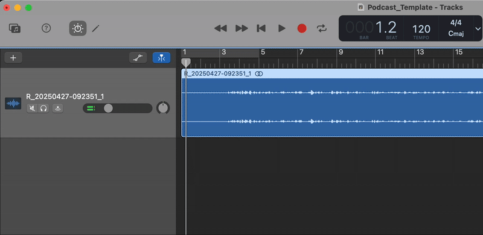
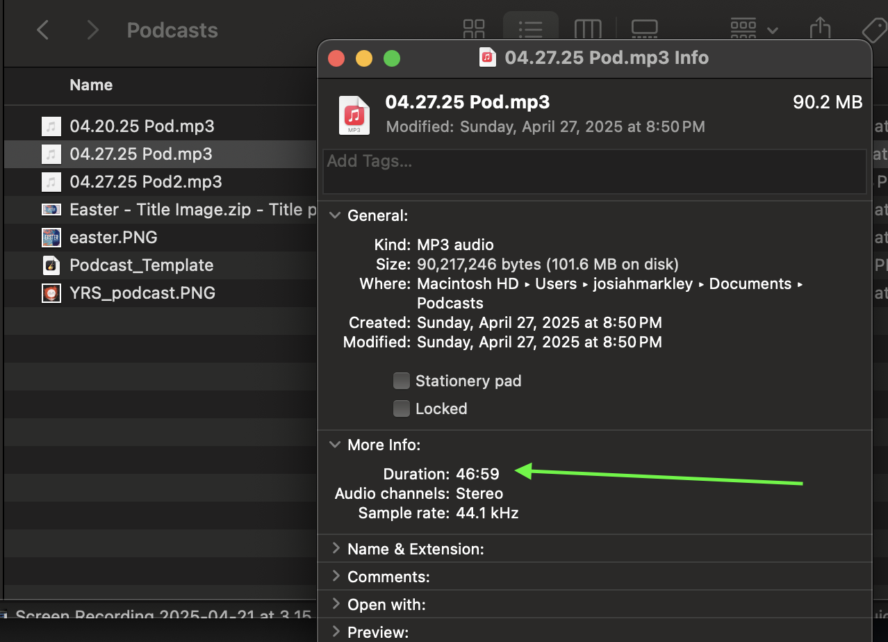

# Podcast Workflow

## Overview:

Each week the raw teaching audio is recorded on the x32 console to a USB stick (named X32) as a `.wav` file. The file is automatically named based on the following convention: `R_YYYYMMDD-TIMESTAMP.wav`. This file is edited to trim excess before and after the message, mastered to noramlize audio and given automation to fade in/out. This file is exported as a .mp3. Next a new blog post is added on the Bright City squarespace website under /teaching. After the new blog post is published, an RSS feed is automatically created from the blog post. This RSS feed is then consumed by Spotify and Apple Podcasts. The one-time setup for the Bright City podcast has been done on those platforms pointing to our specific domain as the source of the epidose. 

 <h2>1. Audio Edit</h2> 

- [ ] Open Finder and local `X32`, open and confirm a `.wav` file exists for the expected date/time

- [ ] Open `GarageBand` and copy the file from the USB onto the first track

- [ ] Scrub track to find the start of the teaching

- [ ] Enabled `Automation` and use the tool to fade in the audio. The goal here is a gradule ramping of volumn that reaches the normal level just before the speaker begins

- [ ] Go to the end of the track and scrub to find the "Amen" that closes the teaching. Start the fade-out automation here. 

> [!NOTE]
> The total fade-in/out time should be 1-2 seconds

- [ ] After the fade-out is complete, trim the rest of the track

- [ ] Export:

   - In the header select `Share` > `Export song to disk...`

   - Name the file on your local as `MM.DD.YY Pod`

   - Select the `MP3` option 

   - Select the `Highest Quality (256 kbit/s)` option

   - Click `Export`

- [ ] Once the above is complete find the file and play it locally as a sanity check

- [ ] Right click on file > `Get Info` and record the `Duration` from the `More Info` section. Should be in `MM.SS` format

 <h2>2. Website Upload</h2> 

