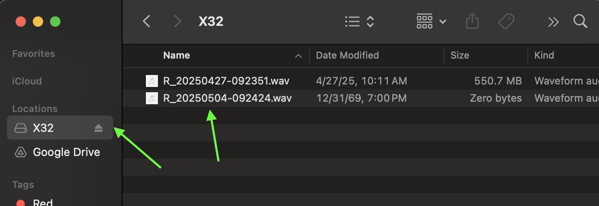
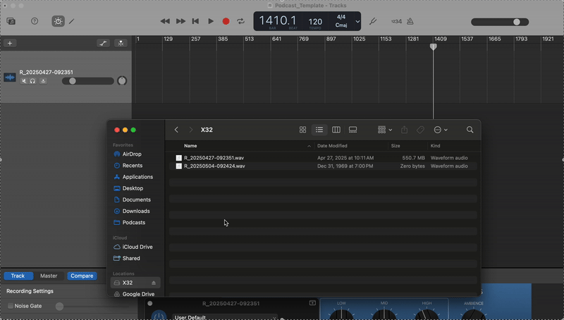
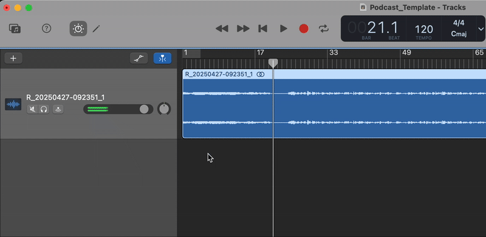
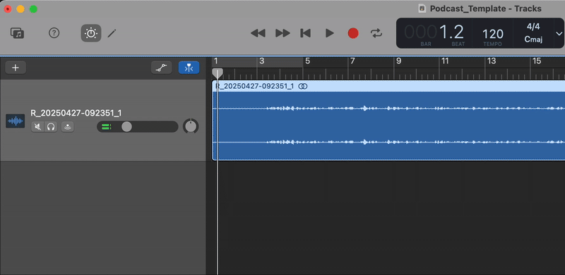
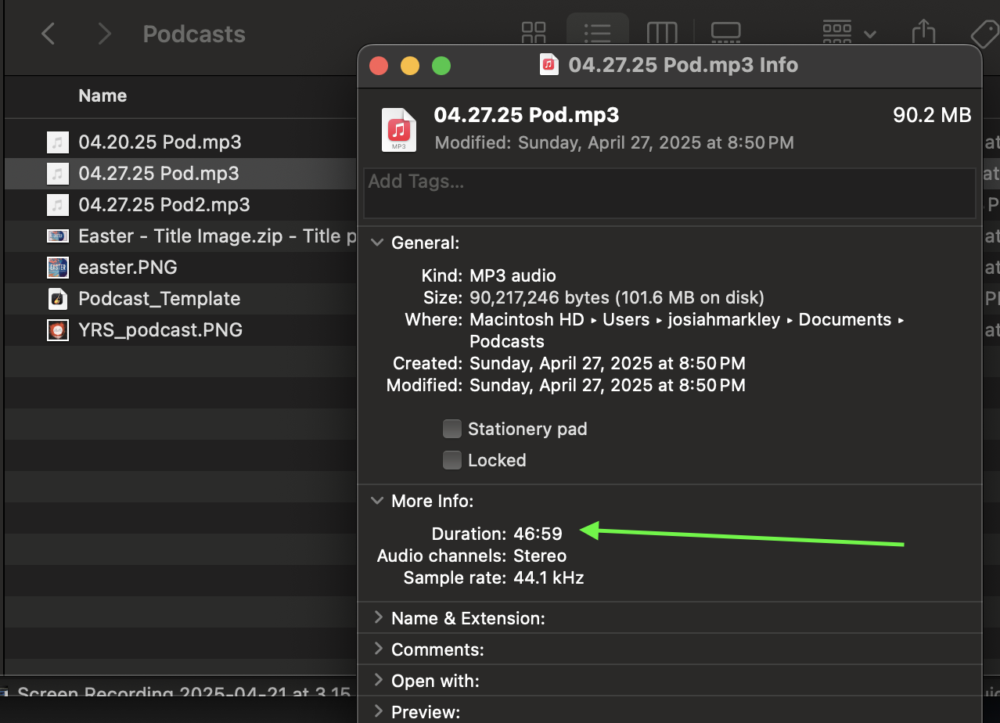

## Audio Edit

- Open Finder and locate `X32`, open and confirm a `.wav` file exists for the expected date/time

- Open `GarageBand` and copy the file from the USB onto the first track

- Scrub track to find the start of the teaching

- Enabled `Automation` and use the tool to fade in the audio. The goal here is a gradule ramping of volumn that reaches the normal level just before the speaker begins

- Go to the end of the track and scrub to find the "Amen" that closes the teaching. Start the fade-out automation here. 

> [!NOTE]
> The total fade-in/out time should be 1-2 seconds

- After the fade-out is complete, trim the rest of the track

- Export:

   - In the header select `Share` > `Export song to disk...`

   - Name the file on your local as `MM.DD.YY Pod`

   - Select the `MP3` option 

   - Select the `Highest Quality (256 kbit/s)` option

   - Click `Export`

- Once the above is complete find the file and play it locally as a sanity check

- Right click on file > `Get Info` and record the `Duration` from the `More Info` section. Should be in `MM.SS` format

[Back to Workflow](podcast-workflow.md)