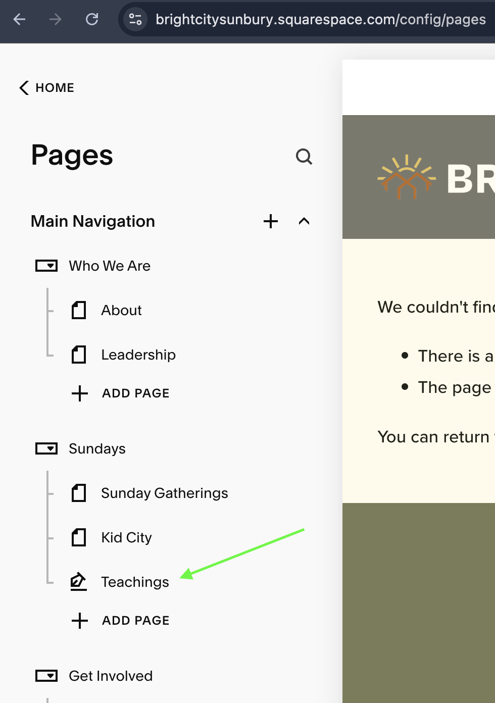
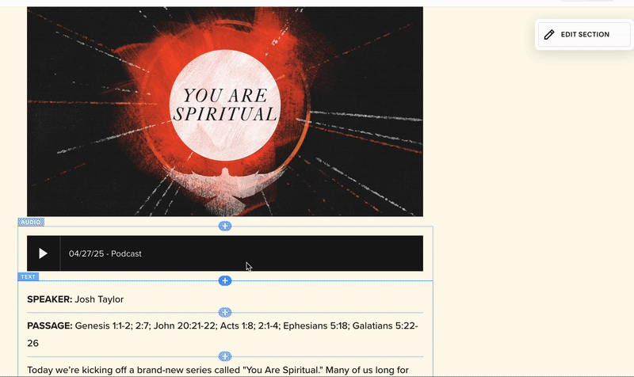
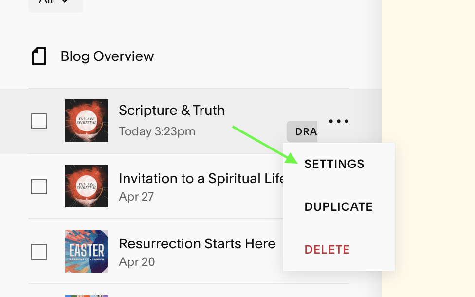
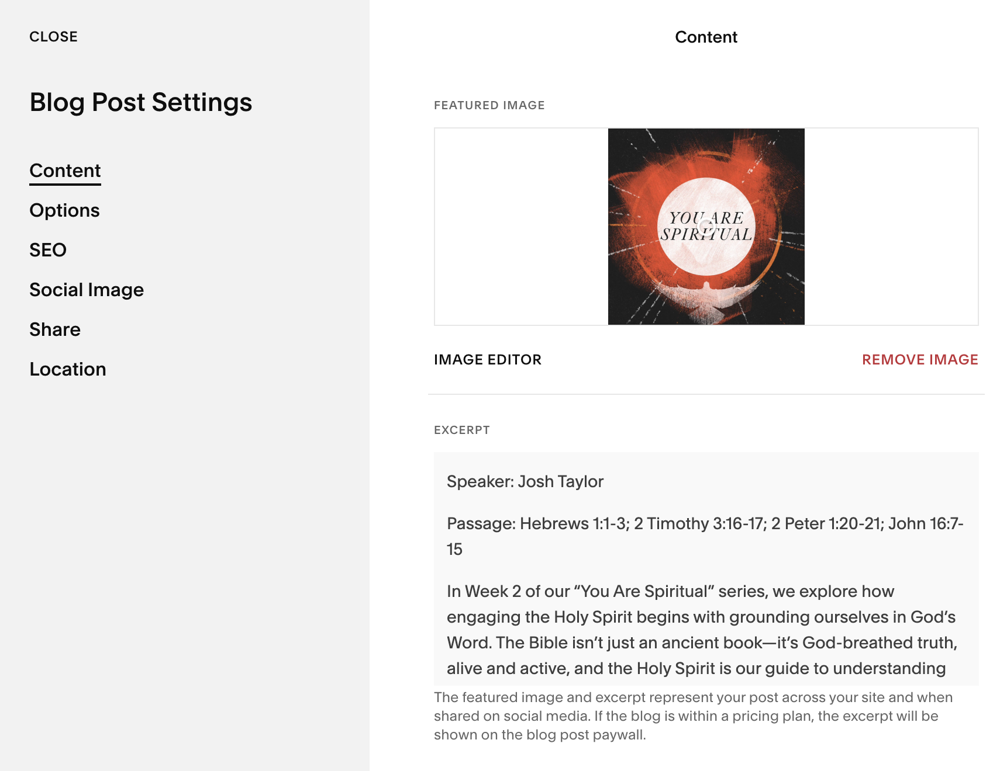
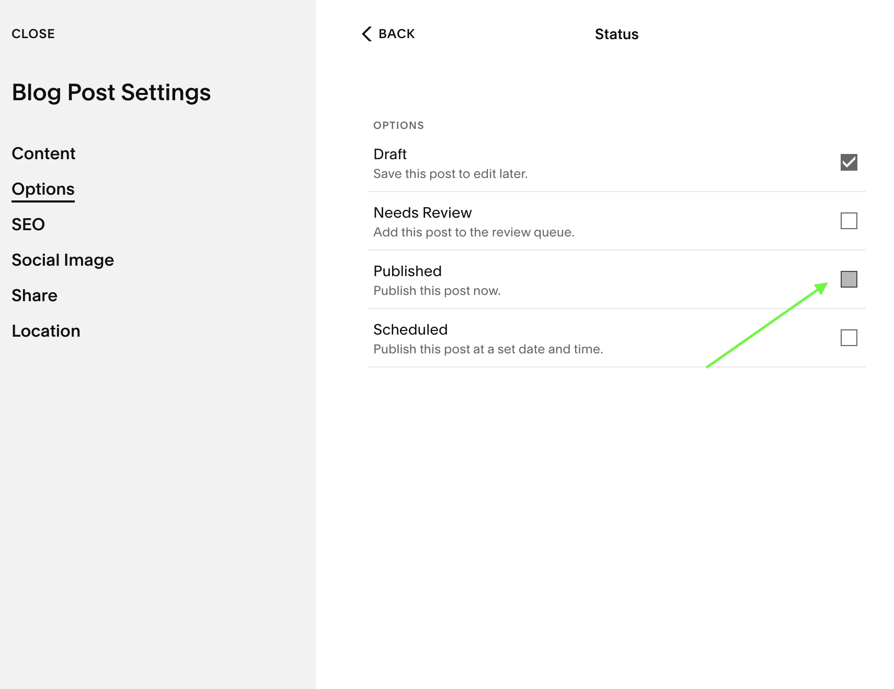

## Squarespace Pod Upload

> [!WARNING] 
> Must have write access on the Bright City website to complete this step.

> [!WARNING] 
> Read access to the `BRIGHT CITY MASTER PLAN` is also required

- Navigate to https://brightcitysunbury.squarespace.com/login and authenticate

- On the left browse to Teachings

- Edit the resulting page by populated the following details from the `MASTER PLAN` xls

   - Header
   - Main image (if new series)
   - Text block at bottom of page

- Edit the "Podcast" section by clicking on the black box and then clicking the pencil

- In the resulting "AUDIO" window: 

   - "Embed" tab edits:

      - Delete the existing file and upload the current `.mp3` off your local computer. Wait for the upload to complete before moving on...
      - Podcast Titel by updating to the date of the teaching

   - "Podcasting" tab edits:

      - Title
      - Summary
      - Episode Number (running total per year)
      - Episode Duration (from last step in audio edit workflow)
    
- `Save` the page and `Exit`

- Access `SETTINGS` on your new blog post

- In the resulting window much of the same information needs to be input a second time on the `Content` tab

    - Select the "Podcast Icon" for the current teaching series. This image must be:
       - 3000px X 3000px
       - `.PNG`
       - Without `Alpha channels`

    - In `Excerpt` section update Speaker, Passages and summary from the MASTER PLAN

    - Modify the `POST URL` to be unique and meaningful. This should almost always be the sermon title, seperated by hyphens. However it needs to be a unique address on our /teaching domain. 

    

- Publish the blog page from the `Options` tab in `Settings` by selecting the `Published` Status

